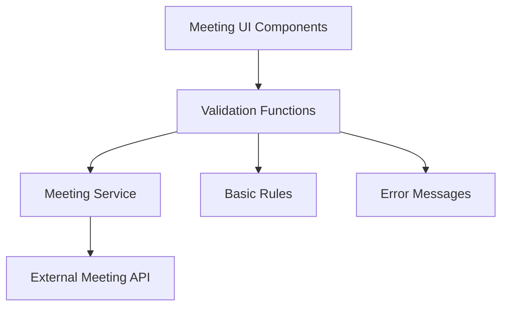
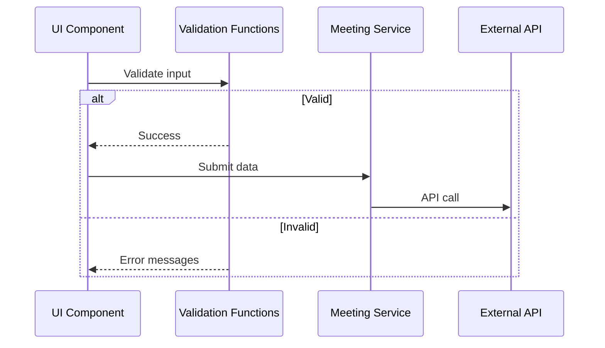

# Design Document: Meeting Service Validation

## Overview

This design implements simple, essential input validation for the meeting service to ensure data integrity and provide immediate user feedback. The validation will be implemented as lightweight functions that validate meeting data before API calls, focusing on the most critical validation rules without complex architecture.

The approach prioritizes simplicity and maintainability while covering the essential validation requirements.

## Architecture

### Simple Validation Approach



The validation will be implemented as simple utility functions that can be called directly from UI components or the meeting service before API calls.

### Validation Flow



## Components and Interfaces

### Simple Validation Functions

#### Core Validation Functions

```typescript
// Simple validation functions that return error messages or null
export const validateMeetingTitle = (title: string): string | null => {
  if (!title?.trim()) return 'Title is required';
  if (title.trim().length < 3) return 'Title must be at least 3 characters';
  return null;
};

export const validateMeetingTimes = (startTime: string, endTime: string): string | null => {
  const start = new Date(startTime);
  const end = new Date(endTime);
  
  if (start >= end) return 'End time must be after start time';
  if (start < new Date(Date.now() + 5 * 60000)) return 'Start time must be at least 5 minutes in the future';
  
  const duration = end.getTime() - start.getTime();
  if (duration > 8 * 60 * 60 * 1000) return 'Meeting cannot exceed 8 hours';
  
  return null;
};

export const validateEmail = (email: string): string | null => {
  const emailRegex = /^[^\s@]+@[^\s@]+\.[^\s@]+$/;
  if (!emailRegex.test(email)) return 'Invalid email format';
  return null;
};

export const validateDescription = (description?: string): string | null => {
  if (description && description.length > 1000) return 'Description cannot exceed 1000 characters';
  return null;
};
```

#### Validation Result Type

```typescript
interface ValidationResult {
  isValid: boolean;
  errors: string[];
}

// Helper function to combine validation results
export const combineValidations = (...validations: (string | null)[]): ValidationResult => {
  const errors = validations.filter(v => v !== null) as string[];
  return {
    isValid: errors.length === 0,
    errors
  };
};
```

#### Meeting Validation Functions

```typescript
export const validateCreateMeeting = (data: CreateMeetingDto): ValidationResult => {
  return combineValidations(
    validateMeetingTitle(data.title),
    validateMeetingTimes(data.startTime, data.endTime),
    validateDescription(data.description)
  );
};

export const validateUpdateMeeting = (data: UpdateMeetingDto): ValidationResult => {
  const validations: (string | null)[] = [];
  
  if (data.title !== undefined) {
    validations.push(validateMeetingTitle(data.title));
  }
  
  if (data.startTime && data.endTime) {
    validations.push(validateMeetingTimes(data.startTime, data.endTime));
  }
  
  if (data.description !== undefined) {
    validations.push(validateDescription(data.description));
  }
  
  return combineValidations(...validations);
};

export const validateExternalEmail = (data: InviteExternalEmailDto): ValidationResult => {
  return combineValidations(
    validateEmail(data.email),
    data.name ? validateParticipantName(data.name) : null
  );
};

const validateParticipantName = (name: string): string | null => {
  const nameRegex = /^[a-zA-Z\s\-']+$/;
  if (!nameRegex.test(name)) return 'Name can only contain letters, spaces, hyphens, and apostrophes';
  return null;
};
```

## Data Models

### Simple Validation Types

```typescript
interface ValidationResult {
  isValid: boolean;
  errors: string[];
}

// Basic sanitization function
export const sanitizeText = (input: string): string => {
  return input
    .trim()
    .replace(/<[^>]*>/g, '') // Remove HTML tags
    .replace(/[^\x20-\x7E]/g, ''); // Remove non-printable characters
};
```

### Integration with Meeting Service

```typescript
// Enhanced meeting service functions with simple validation
export const createMeetingWithValidation = async (data: CreateMeetingDto): Promise<Meeting> => {
  const validation = validateCreateMeeting(data);
  
  if (!validation.isValid) {
    throw new Error(`Validation failed: ${validation.errors.join(', ')}`);
  }
  
  // Sanitize text fields
  const sanitizedData = {
    ...data,
    title: sanitizeText(data.title),
    description: data.description ? sanitizeText(data.description) : undefined
  };
  
  return createMeeting(sanitizedData);
};
```
## Correctness Properties

*A property is a characteristic or behavior that should hold true across all valid executions of a system-essentially, a formal statement about what the system should do. Properties serve as the bridge between human-readable specifications and machine-verifiable correctness guarantees.*

After analyzing the acceptance criteria, several properties can be consolidated to eliminate redundancy. For example, title validation applies to both creation and updates, and error handling follows the same pattern across all validation functions.

### Property 1: Title Validation

*For any* meeting title, it must be non-empty and contain at least 3 characters after trimming.

**Validates: Requirements 1.1, 2.1**

### Property 2: Time Validation

*For any* meeting, the end time must be after the start time and the start time must be in the future.

**Validates: Requirements 1.2, 1.3, 2.2, 2.3**

### Property 3: Duration Validation

*For any* meeting, the duration must not exceed 8 hours.

**Validates: Requirements 1.4, 5.4**

### Property 4: Description Validation

*For any* meeting description, if provided, it must not exceed 1000 characters.

**Validates: Requirements 1.5, 2.4**

### Property 5: Email Format Validation

*For any* email address, it must match standard email format.

**Validates: Requirements 4.1**

### Property 6: Text Sanitization

*For any* text input, HTML tags and non-printable characters must be removed.

**Validates: Requirements 6.1, 6.2, 6.4**

### Property 7: Validation Error Messages

*For any* validation failure, clear error messages must be returned.

**Validates: Requirements 1.6, 2.6, 7.1**

## Error Handling

### Simple Error Handling

Validation functions return simple string error messages or null for success. Multiple errors are collected in an array.

```typescript
// Example usage in UI components
const [errors, setErrors] = useState<string[]>([]);

const handleSubmit = () => {
  const validation = validateCreateMeeting(formData);
  if (!validation.isValid) {
    setErrors(validation.errors);
    return;
  }
  // Proceed with submission
};
```

## Testing Strategy

### Simple Testing Approach

**Unit Tests** will cover:
- Each validation function with valid and invalid inputs
- Error message content and format
- Text sanitization behavior
- Integration with meeting service functions

**Property-Based Tests** will verify:
- Validation consistency across random inputs
- Sanitization preserves valid content
- Performance stays within limits

### Example Test Structure

```typescript
// Unit test example
test('validateMeetingTitle', () => {
  expect(validateMeetingTitle('')).toBe('Title is required');
  expect(validateMeetingTitle('ab')).toBe('Title must be at least 3 characters');
  expect(validateMeetingTitle('Valid Title')).toBe(null);
});

// Property test example  
test('title validation property', () => {
  fc.assert(fc.property(
    fc.string(),
    (title) => {
      const result = validateMeetingTitle(title);
      const trimmed = title.trim();
      
      if (trimmed.length >= 3) {
        expect(result).toBe(null);
      } else {
        expect(result).toContain('Title');
      }
    }
  ), { numRuns: 100 });
});
```